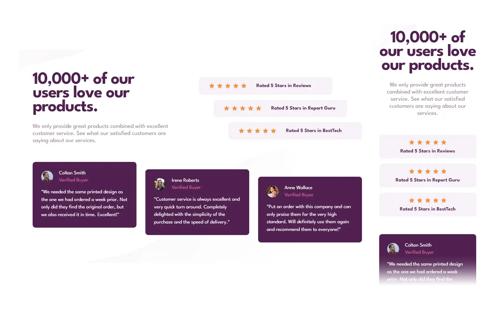

# Frontend Mentor - Social proof section solution

This is a solution to the [Social proof section challenge on Frontend Mentor](https://www.frontendmentor.io/challenges/social-proof-section-6e0qTv_bA). Frontend Mentor challenges help you improve your coding skills by building realistic projects.

## Table of contents

- [Overview](#overview)
  - [The challenge](#the-challenge)
  - [Screenshot](#screenshot)
  - [Links](#links)
- [My process](#my-process)
  - [Built with](#built-with)
  - [What I learned](#what-i-learned)
- [Author](#author)

## Overview

### The challenge

Users should be able to:

- View the optimal layout for the section depending on their device's screen size

### Screenshot

### Links

- Solution URL: [Add solution URL here](https://your-solution-url.com)
- Live Site URL: [Add live site URL here](https://your-live-site-url.com)

## My process

### Built with

- Semantic HTML5 markup & CSS
- Flexbox
- CSS Grid
- Desktop-first workflow

### What I learned

Desktop browser devtools can't always be trusted. I spent hours trying to fix misaligned elements in Brave only for it to suddenly work without flaws.

Also, one has to be careful with conflicting CSS media queries.

## Author

- Frontend Mentor - [@RainOfTea](https://www.frontendmentor.io/profile/RainOfTea)
- GitHub - [@RainOfTea](https://github.com/RainOfTea)
